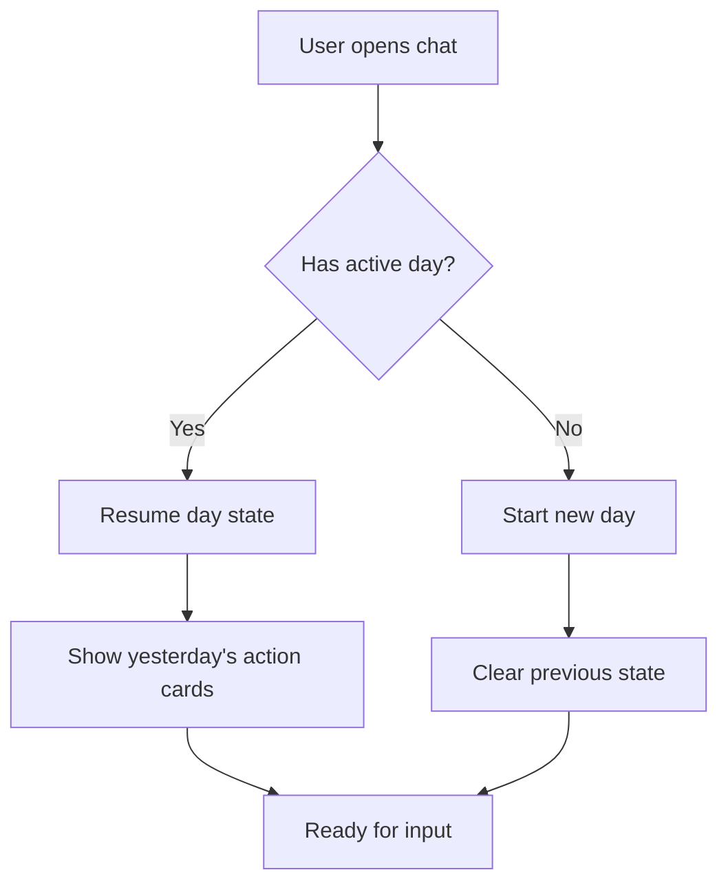

# Visual Auditor Skill — YAHA

**Purpose:** Verify that implemented features match their specification and architecture.

**When to use:** After implementation is complete, BEFORE QA testing. Use to audit complex flows (state machines, multi-step processes, data transformations).

**Output:** Detailed Mermaid.js flowcharts + architecture validation report.

## Workflow

### Step 1: Understand the Feature

Read the spec document and implementation files:

1. Get the feature specification (from `docs/plans/` or the technical log)
2. Read key implementation files:
   - Database access layer (`src/lib/db/`)
   - Server actions or API routes
   - UI components (`src/components/`)
   - Tests in `src/__tests__/`

### Step 2: Analyze Data Flow

Trace how data moves through the system:

- **Input**: How does data enter (form input, API, webhook)?
- **Processing**: What transformations occur? Validation? AI processing?
- **Storage**: Where is data stored (DB tables, JSONB fields)?
- **Output**: What does the user see? What APIs are called?
- **Edge cases**: How are errors handled at each step?

### Step 3: Generate Mermaid Diagrams

Create 2-3 Mermaid diagrams showing:

**Diagram 1: User Flow** (happy path)
- Start → user action → system response → end state
- Example: User logs health data → AI processes → action card appears → user confirms → log saved

**Diagram 2: Data Flow** (detailed)
- Component → Server Action → DB → AI API → DB update → UI update
- Show all system boundaries (client/server, internal/external APIs)

**Diagram 3: State Machine** (if applicable)
- For workflows with multiple states (routine steps, day session lifecycle)
- Show transitions and edge cases

**Diagram Syntax** (Mermaid.js):



### Step 4: Validate Against Specification

Check:
- ✅ All user flows from spec are implemented
- ✅ All data transformations match spec
- ✅ All edge cases have error handling
- ✅ UI states match spec (loading, success, error, empty)
- ✅ Database schema matches data flow (all fields used, no unused fields)
- ✅ API integrations work as specified (auth, rate limits, error recovery)
- ✅ Security rules enforced (RLS, auth checks, input validation)

### Step 5: Ask Clarifying Questions

If you find issues, use `AskUserQuestion` to clarify:

- "Does the routine persist when the user navigates away mid-routine? I see no session persistence in the code."
- "The spec says 'retry failed logs automatically' but I don't see retry logic. Should this be added?"
- "The action card shows loading state but takes 3+ seconds. Should there be a timeout?"

### Step 6: Generate Audit Report

Output a markdown report with:

**🔍 Architecture Review**
- Data flow matches specification: ✅ / ⚠️ / ❌
- UI states implemented: ✅ / ⚠️ / ❌
- Error handling complete: ✅ / ⚠️ / ❌
- Database schema correct: ✅ / ⚠️ / ❌

**📊 Mermaid Diagrams** (embedded in markdown)

**⚠️ Issues Found** (if any)
- [severity] Description
- [severity] Description

**✅ Passing Checks**
- All spec requirements implemented
- Edge cases handled
- Error messages user-friendly
- Performance acceptable

---

## Example Output Format

```markdown
# Visual Audit: Daily Routine Persistence

## Architecture Review

✅ **Data flow matches specification**
- User input → action → DB save → UI update (verified in RoutineStep.tsx → updateRoutineProgress action)
- State persists via `routines.current_step` column (matches spec)

✅ **UI states implemented**
- Loading: RoutineStep shows spinner during updateRoutineProgress (line 45-48)
- Success: Step advances, next step displays (line 52-54)
- Error: Toast notification appears (ChatInterface.tsx line 120)
- Empty: "No active routine" message shows (line 61)

⚠️ **Error handling incomplete**
- Network error on step update: handled ✅
- Invalid step index: not handled ❌ (needs reset to step 0)
- Routine >24h old: not handled ❌ (should clear active state)

✅ **Database schema correct**
- routines.current_step used for persistence (matches spec)
- routine_active_at tracks session start (enables stale detection)
- No unused fields in schema

## Data Flow Diagram

\`\`\`mermaid
graph TD
    A[User clicks next step] --> B[RoutineStep sends update]
    B --> C[updateRoutineProgress action]
    C --> D{Auth check}
    D -->|Fail| E[Return error]
    D -->|Pass| F[Update DB: current_step++]
    F --> G{Step index valid?}
    G -->|Yes| H[Increment succeeds]
    G -->|No| I[Return error]
    H --> J[Revalidate routines page]
    J --> K[Component re-fetches state]
    K --> L[UI shows next step]
    E --> M[Show error toast]
    I --> M
\`\`\`

## Issues Found

- ⚠️ **Missing edge case handling**: Invalid step index not reset. Recommend: `if (newStep >= maxSteps) reset to 0`
- ⚠️ **Stale routine not cleared**: Routine active >24h should auto-clear. Recommend: Add `routine_active_at` check in action.

## Passing Checks

- ✅ All core flows from spec implemented
- ✅ Database changes applied correctly
- ✅ Auth checks in place
- ✅ UI responsive during operations
- ✅ Error messages helpful

**Verdict: AUDIT PASS (with minor notes)**
Recommend adding 2-3 edge case tests before QA.
```

---

## Key Rules for Visual Auditor

- **Use Mermaid.js syntax** — creates visual diagrams in markdown
- **Validate, don't guess** — read the code, trace the flow
- **Focus on data flow** — not implementation details
- **Check spec compliance** — every requirement must be present
- **Output only markdown + diagrams** — return audit report to orchestrator
- **Identify gaps early** — better to find edge cases now than in QA
